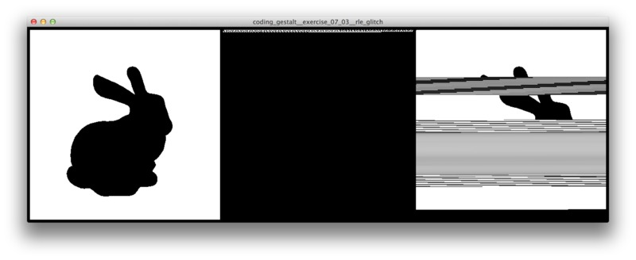

Code and Compression
====================

## Let's Play

Let's play the [Compression Game][]

# Working with Sequences

* Alphabet: A = {a,b,c, ... } (Set of tokens)
* Sequence: S = (t1, t2, t3, ...) (String of tokens)
* Size of Alphabet: |A|
* Encodings (ASCII, Unicode, Binary ...)

### Recap: Turtle Graphics

* Mapping Token Sequences to Turtle Graphics
   * Absolute direction corresponding to a token
   * Relative direction corresponding to a token

## Run Length Encoding (RLE)

#### Visual Example I ####

The original image is on the left, runlength code in the center, decoded image on the right.  
Each pixel corresponds to one token (or one byte).

#### Visual Example II ####

Original image on the left, glitched runlength code in the center, decoded image on the right.

#### Approach ####

Identify repeating Tokens.

* Scale Level: Tokens

#### Encoding Example

* rle(`11111111111111111111`, 1) → 9`1` + 9`1` + 2`1` → `919192`
* rle(`11111222333333333333`, 1) → 5`1` + 3`2` + 9`3` + 3`3`  → `51329333`
* rle(`12345678912345678912`, 1) → 1`1` + 1`2` + 1`3` + 1`1` + 1`2` + 1`3` → `112131415161718191112131415161718191112`

#### Decoding Example

* rle(`123456789123456789`, -1) → 1`2` + 3`4` + 5`6` + 7`8` + 9`1` + 2`3` + 4`5` + 6`7` + 8 `9`= `2444666668888888133555577777799999999`

#### Problems

* How to save the RLE as a sequence of tokens?

   1. Fixed Token Size + Maximum Repeat  
   2. Fixed Token Size + Escape Codes (See also: UTF8)
   3. Seperator Token

## Delta Encoding

Identify Differences between successive Tokens

* Scale Level: Ordered Tokens, Circluar Ordered Tokens

#### Encoding Example

* delta(`11111111111111111111`, 1) → `10000000000000000000`
* delta(`11111222333333333333`, 1) → `10000100100000000000`
* delta(`12345678912345678912`, 1) → `11111111121111111121`

#### Decoding Example

* delta(`00000000000000000000`, -1) → `00000000000000000000`
* delta(`11111111111111111111`, -1) → `1234567890123456789)0` 

## Index Encoding

* Identify Sequences of Tokens encountered before

#### Encoding Example

* idx(`123123123123`, 1) → `1` + `2`  +`3` + mem(-3,3) + mem(-3, 3) → `0102033333`
* idx(`12345678912345678912`)  → `1` + `2` + `3`+ `4` + `5` + `6` + `7` + `8` + `9` → mem(9, 9) + mem(9,2)  → `0102030405060708099992`

#### Decoding Example

* idx(`0102033366`) → `123` + idx(`3366`)  → `123123`+ idx(`66`)   → `123123123123`

## Grammar Encoding

* Replace frequently used tokens by new tokens (i.e. Frequency Encoding)
* Rewrite results as a Grammar

#### Encoding Example

* (1212121212121212121212) → (`33333333333`, `3` →  `12`)
* (1122112211221122112211) → (`34343434343`, `3` → `11`, `4`  → `22`)

### LZW Encoding

* Lempel-Ziv-Welch Encoding (LZW) = Frequency + Index Encoding
* ZIP files!
* [Lempel-Ziv-Welch](http://en.wikipedia.org/wiki/Lempel%E2%80%93Ziv%E2%80%93Welch) (LZW) on Wikipedia

### Sequitur

* [The Algorithm](http://en.wikipedia.org/wiki/Sequitur_algorithm) on Wikipedia
* [Sequitur Website](http://www.sequitur.info/) + Live Demo + Code in various languages!
* [Inferring Sequential Structure](http://www.sequitur.info/Nevill-Manning.pdf) – PHD Thesis of Nevill-Manning (PDF)

### Upwrite Predictor ###

* [Upwrite Predictor](https://web.archive.org/web/20000817201718/http://ciips.ee.uwa.edu.au/~hutch/phd/) Project Site on Archive.org
* [The UpWrite Predictor]( ) *A General Grammatical Inference Engine for Symbolic Time Series, with Applications in Natural Language Acquisition and Data Compression* – PHD Thesis of Jason Hutchens (PDF)

## Exercises

Exercises can be found [here](exercises).

## Solutions

Solutions can be found [here](solutions).

## Papers

* [Papers on Grammar Based Coding](http://www.compression.ru/download/grammar.html) 
* [Compression.RU](http://www.compression.ru/) – excellent resource (Russian)

[Compression Game]:[../games/compression_game]
