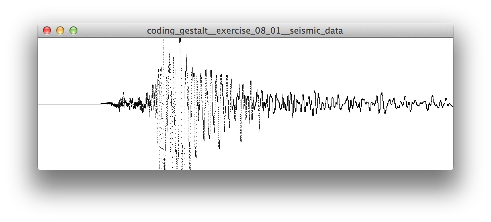

Exercises — Visual Form 
=======================

### [Exercise 01][] – Seismic Data

1. Download and Install the [Global Earthquake Explorer](http://www.seis.sc.edu/gee/)
2. Export some data in SAC format + drop it in the data folder
3. Create a sketch to visualize the data 
4. Identify events and visualize them

### [Exercise 02][] – Circadian Data

1. Pick a data set from the circadian data folder
2. Create a sketch to read and display the data
3. Identify events and display them

### [Exercise 03][] – IanniX

1. Get the latest version of [IanniX](http://www.iannix.org/)
2. Play some of the scores included in the examples
3. Run the processing sketch to receive and visualize the OSC signals

[Exercise 01]: coding_gestalt__exercise_08_01__seismic_data
[Exercise 02]: coding_gestalt__exercise_08_02__circadian_data
[Exercise 03]: coding_gestalt__exercise_08_03__iannix
