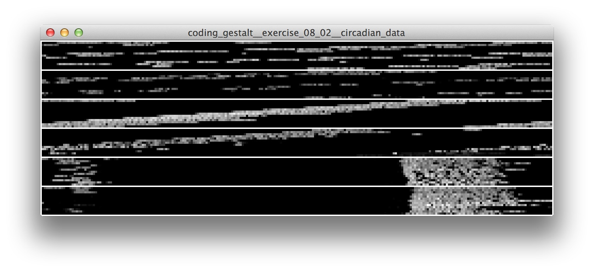

# Gestalt and Time

In this lecture we will learn how to:

* work with time series
* create visual representations of the events
  
## Data Sources

Data sources can be found [here](../data/readme.md).

### Sesimic Data

### Circadian Data

### IanniX

## Exercises

Exercises can be found [here](exercises).

